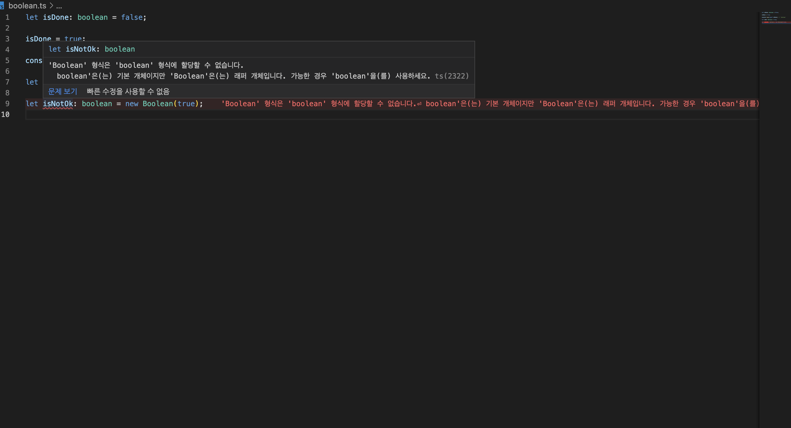

# 타입스크립트

## 타입스크립트란?

- 타입스크립트는 프로그래밍 언어이다.
- 타입스크립트는 컴파일 언어이다.
  - 전통적인 컴파일 언어와는 다른 점이 많다.
  - 그래서 트랜스파일이라는 용어를 사용하기도 한다.
- 자바스크립트는 인터프리티드 언어이다.

|                    | 컴파일 (Compiled)               | 인터프리트 (Interpreted) |
| ------------------ | ------------------------------- | ------------------------ |
| 컴파일 필요 여부   | 필요                            | 불필요                   |
| 컴파일러 필요 여부 | 필요                            | 불필요                   |
| 컴파일 시점        | 컴파일하는 시점                 | 컴파일하는 시점 없음     |
| 실행 방식          | 컴파일된 결과물을 실행          | 코드 자체를 실행         |
| 실행 시점          | 컴파일된 결과물을 실행하는 시점 | 코드를 실행하는 시점     |

---

# Type Annotation

## Type Annotation 이란?

자바스크립트와 가장 차별되는 기능

타입이라는 요소가 코드상에 드러나는 방식

```tsx
let a = "Mark";

a = 39;

// 'number' 형식은 'string' 형식에 할당할 수 없습니다. 라는 문구와 함께 a에 빨간 밑줄이 그어진다.
```

타입스크립트는 let이라는 키워드를 만나고 값을 할당 받으면 임의로 a라는 변수에 특정한 타입을 지정해둔다. 따라서 a라고 하는 변수는 “Mark”(string)로 부터 타입이 만들어진다.

### 할당을 안 하고 선언만 할 시

```tsx
let a; // 'a' 변수는 암시적으로 'any' 형식이지만, 사용량에서 더 나은 형식을 유추할 수 있습니다.

// = "Mark";

// a = 39;
```

a의 타입에는 any라는 타입이 지정된다.

### a의 변수에 타입을 지정할 시

```tsx
let a: string;

a = "Mark";
```

```tsx
let a: number;

// a = "Mark";

a = 39;
```

```tsx
function hello(b: number) {}

hello(39);
// helllo('Mark')
```

어떤 특정한 변수, 어떤 특정한 객체 등의 어떤 타입이다라고 지정해주는 것을 Type Annotation 이다.

---

# TypeScript Types vs JavaScript Types

TypeScript는 Static Types,

JavaScript는 Dynamic Types

Static Type은 개발하는 중간에 타입을 체크한다.

하지만 자바스크립트의 다이나믹 타입은 개발하는 도중에는 알 수가 없고 실제 런타임에 돌입해야만 잘못된 걸 알 수 있다.

```tsx
// JavaScript
function add(n1, n2) {
  if (typeof n1 !== "number" || typeof n2 !== "number") {
    throw new Error("Incorrect input!");
  }
  return n1 + n2;
}
const result = add(39, 28);

// TypeScript
function add(n1: number, n2: number) {
  return n1 + n2;
}
const result = add(39, 28);
```

- 프로그램이 유용하려면, 가장 간단한 데이터 단위로 작업할 수 있어야 한다.
  - numbers, strings, structures, boolean 값 등등
- TypeScript에서, 우리는 JavaScript 에서 기대하는 것과 동일한 타입을 지원하며, 돕기 위해 추가적인 열거 타입이 제공되었다.
- TypeScript 에서 프로그램 작성을 위해 기본 제공하는 데이터 타입
- **\*\***사용자가 만든 타입은 결국 이 기본 자료형들로 쪼개진다.**\*\***
- JavaScript 기본 자료형을 포함 (superset)
  - \***\*ECMAScript 표준에 따른 기본 자료형은 6가지\*\***
    - Boolean
    - Number
    - String
    - Null
    - Undefined
    - Symbol (ECMAScript 6에 추가)
    - Array: object 형
- \***\*\*\*\*\***\*\*\***\*\*\*\*\***\*\*\***\*\*\*\*\***\*\*\***\*\*\*\*\***\*\*\*\*\***\*\*\*\*\***\*\*\***\*\*\*\*\***\*\*\***\*\*\*\*\***\*\*\***\*\*\*\*\***프로그래밍을 도울 몇가지 더 제공된다.\***\*\*\*\*\***\*\*\***\*\*\*\*\***\*\*\***\*\*\*\*\***\*\*\***\*\*\*\*\***\*\*\*\*\***\*\*\*\*\***\*\*\***\*\*\*\*\***\*\*\***\*\*\*\*\***\*\*\***\*\*\*\*\***
  - Any, Void, Never, Unknown
  - Enum
  - Tuple: object 형

---

# Primitive Type

- 오브젝트와 레퍼런스 형태가 아닌 실제 값을 저장하는 자료형
- 프리미티브 형의 내장 함수를 사용 가능한 것은 자바스크립트 처리 방식 덕분
- (ES2015 기준) 6가지
  - boolean
  - number
  - string
  - symbol (ES2015)
  - null
  - undefined

```tsx
let name = "mark";
name.toString();
```

\***\*\*\*\*\*\*\***\*\*\*\*\***\*\*\*\*\*\*\***Primitive Type\***\*\*\*\*\*\*\***\*\*\*\*\***\*\*\*\*\*\*\***

- literal (값 그 자체를 문자로 값을 할당하는 방식) 값으로 Primitive 타입의 서브 타입을 나타낼 수 있다.

```tsx
ture;
("hello");
3.14;
null;
undefined;
```

- 또는 래퍼 객체로 만들 수 있다.

```tsx
new Boolean(false); // typeof new Boolean(false) : 'object'
new String("world"); // typeof new String('world') : 'object'
new Number(42); // typeof new Number(42) : 'object'
```

\***\*\*\*\*\***\*\*\***\*\*\*\*\***Type Casing\***\*\*\*\*\***\*\*\***\*\*\*\*\***

- TypeScript의 핵심 primitive types 은 모두 소문자이다.
- Number, String, Boolean, Symbol 또는 Object 유형이 위에서 권장한 소문자 버전과 동일하다고 생각하고 싶을 수 있다.
- 이러한 유형은 언어 primitive 를 나타내지 않으며, 타입으로 사용해서는 안된다.
  ```tsx
  function reverse(s: String): String {
    return s.split("").reverse().join("");
  }
  reverse("hello world");
  ```
- 대신 number, string, boolean, object, 그리고 symbol 타입을 사용하면 된다.

---

# Types

## boolean

```ts
let isDone: boolean = false;

isDone = true;

console.log(typeof isDone); // 'boolean'

let isOk: Boolean = true;

let isNotOk: boolean = new Boolean(true);
```



## number

```tsx
let decimal: number = 6; // 10진수

let hex: number = 0xf00d; // 16진수

let binary: number = 0b1010; // 2진수

let octal: number = 0o744; // 8진수

let notANumber: number = NaN; // Not A Number

let underscoreNum: number = 1_000_000;
```

### Number / number

- JavaScript 와 같이, TypeScript 의 모든 숫자는 부동 소수점 값이다.
- TypeScript 는 16진수 및 10진수 리터럴 외에도 ECMAScript 2015에 도입된 2진수 및 8진수를 지원한다.
- NaN
- 1_000_000 과 같은 표기 가능

---

## string

- 다른 언어에서와 마찬가지로 텍스트 형식을 참조하기 위해 ‘string’ 형식을 사용한다.
- JavaScript와 마찬가지로 TypeScript는 문자열 데이터를 둘러싸기 위해 큰 따옴표(””)나, 작은 따옴표(’’)를 사용한다.

```tsx
let myName: string = "Mark";

myName = "Anna";
```

******\*\*******\*\*******\*\*******Template String******\*\*******\*\*******\*\*******

- 행에 걸쳐 있거나, 표현식을 넣을 수 있는 문자열
- 이 문자열은 backtick(``) 기호에 둘러쌓여 있다.
- 포함된 표현식은 `${}` 와 같은 형태로 사용된다.

```tsx
let fullName: string = "Peter Yun";

let age: number = 25;

let sentence: string = `Hello, My name is ${fullName}. 
I'll be ${age + 1} years old next month. `;

console.log(sentence);
```

---

## symbol

- ECMAScript 2015에서 추가된 Symbol
- new Symbol 로 사용할 수 없다.
- Symbol 을 함수로 사용해서 Symbol 타입을 만들어낼 수 있다.

```tsx
console.log(Symbol("foo") === Symbol("foo")); // false
```

- 프리미티브 타입의 값을 담아서 사용한다.
- 고유하고 수정 불가능한 값으로 만들어준다.
- 그래서 주로 접근을 제어하는데 쓰는 경우가 많았다.

```tsx
const sym = Symbol();

const obj = {
  [sym]: "value",
};

obj[sym];
```

---

## Undefined & Null

- TypeScript에서, undefined 와 null 은 실제로 각 undefined 및 null 이라는 타입을 가진다.
- void와 마찬가지로, 그 자체로는 그다지 유용하지 않는다,
- 둘 다 소문자만 존재한다.

### undefined & null 은 다른 모든 타입의 서브 타입으로 존재한다.

- number 에 null 또는 undefined 를 할당할 수 있다는 의미
- 하지만, 컴파일 옵션에서 `--stricNullChecks` 를 사용하면, null과 undefined 는 void나 자기 자신들에게만 할당할 수 있다.
  - 이 경우, null과 undefined를 할당할 수 있게 하려면, union type을 이용해야 한다.
  ```
  // let MyName: string = null;

  // let u: undefined = null;

  let v: void = undefined // null (x)

  let union: string | null = null;

  union = 'Mark';
  ```

**********************\*\*\*\***********************JavaScript에서의 null**********************\*\*\*\***********************

- null이라는 값으로 할당된 것을 null 이라고 한다.
- 무건가가 있는데, 사용할 준비가 덜 된 상태
- null 이라는 타입은 null 이라는 값만 가질 수 있다.
- 런타임에서 typeof 연산자를 사용해 알아내면 object 타입이다.

```tsx
let n: null = null;

console.log(n); // null
console.log(typeof n); // object
```

JavaScript에서의 undefined

- 값을 할당하지 않은 변수는 undefined 라는 값을 가진다.
- 무언가가 아예 준비가 안된 상태
- object의 property가 없을 때도 undefined 이다.
- 런타임에서 typeof 연산자를 사용해 알아내면 undefined 타입이다.

```tsx
let u: undefined = undefined;

console.log(n); // undefined
console.log(typeof n); // undefined
```
